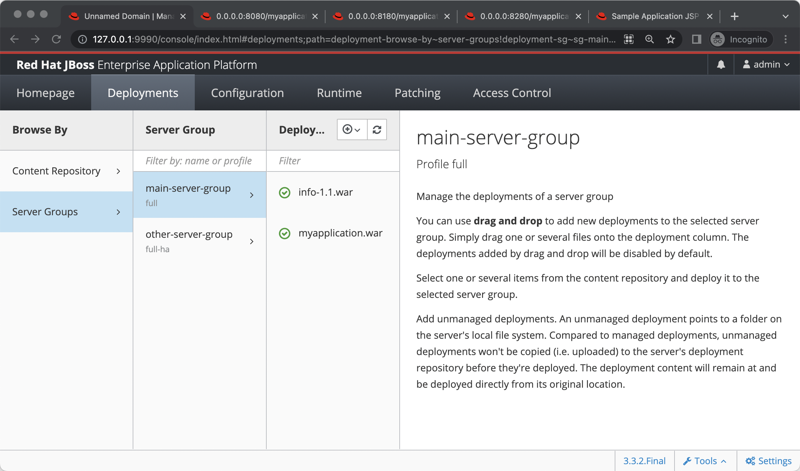
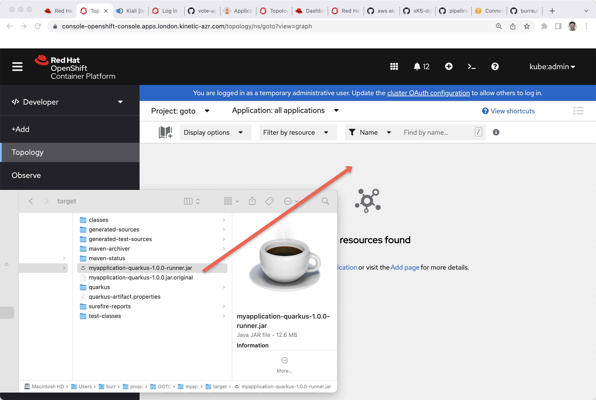
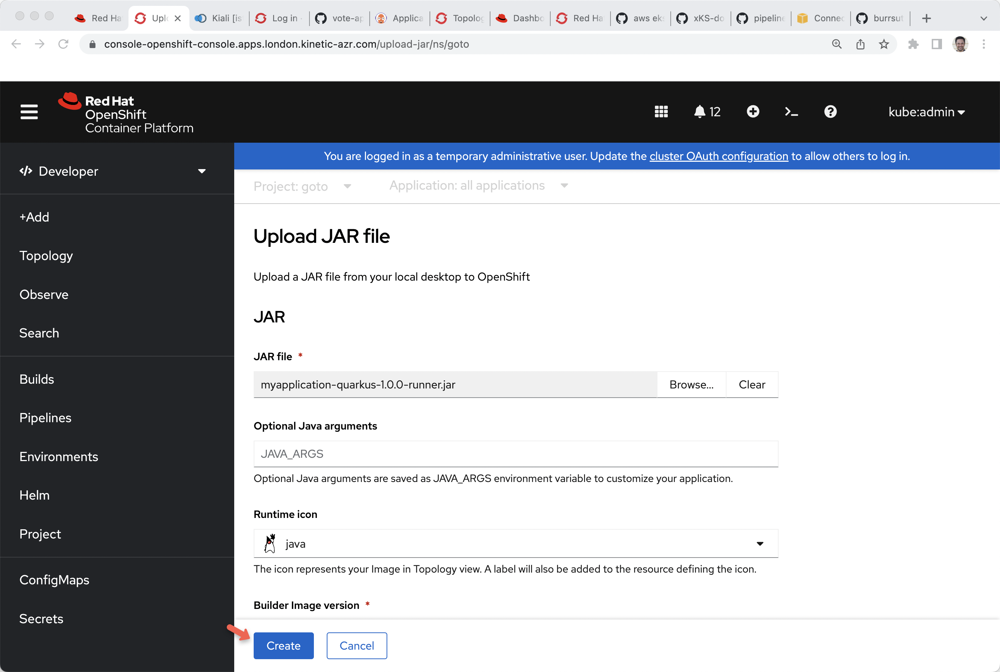

## JBoss

```
export PATH=/Users/burr/projects/GOTOams/jboss-eap-7.4/bin:$PATH%
```

Download

https://developers.redhat.com/content-gateway/file/jboss-eap-7.4.0.zip


Create a domain for 3 server instances

Modified host.xml in jboss-eap-7.4/domain/configuration

```
    <servers>
        <server name="server-one" group="main-server-group"/>
        <server name="server-two" group="main-server-group" auto-start="true">
            <jvm name="default"/>
            <socket-bindings port-offset="100"/>
        </server>
        <server name="server-three" group="main-server-group" auto-start="true">
            <jvm name="default"/>
            <socket-bindings port-offset="200"/>
        </server>
    </servers>

```

Startup 

```
domain.sh -b 0.0.0.0 -bmanagement 0.0.0.0
```

```
cd myapplication-war

mvn compile package

jboss-cli.sh -c --controller=localhost:9990 --command="deploy --force /Users/burr/projects/GOTOams2022/wars/myapplication-war/target/myapplication.war"
```

You can also drag & drop the .war




```
servers=("localhost:8080" "localhost:8180" "localhost:8280")

while true; do
for server in ${servers[@]}; do
  curl $server/myapplication/stuff
done
sleep .3
done
```


##  Kubernetes

#### Start up a Kube cluster some place


https://redhat-scholars.github.io/kubernetes-tutorial/kubernetes-tutorial/installation.html#install-minikube

https://docs.openshift.com/rosa/rosa_install_access_delete_clusters/rosa_getting_started_iam/rosa-installing-rosa.html

https://github.com/burrsutter/xKS-docs


```
cd myapplication-spring

mvn compile package

docker build -f src/main/docker/Dockerfile -t docker.io/burrsutter/myapplication-spring:1.0.0 .

docker login

docker push docker.io/burrsutter/myapplication-spring:1.0.0

```


```
cd myapplication-quarkus

mvn compile package

docker build -f src/main/docker/Dockerfile -t docker.io/burrsutter/myapplication-quarkus:1.0.0 .

docker login

docker push docker.io/burrsutter/myapplication-quarkus:1.0.0

```


```
kubectl create namespace mystuff
kubectl config set-context --current --namespace=mystuff

kubectl apply -f myapplication-deployment-live-ready.yml
kubectl apply -f myapplication-service.yml
# openshift-only
oc expose service myapplication
# produces a public URL route - kubectl get routes
```

You can also drag & drop fat jars to OpenShift Dev Console



