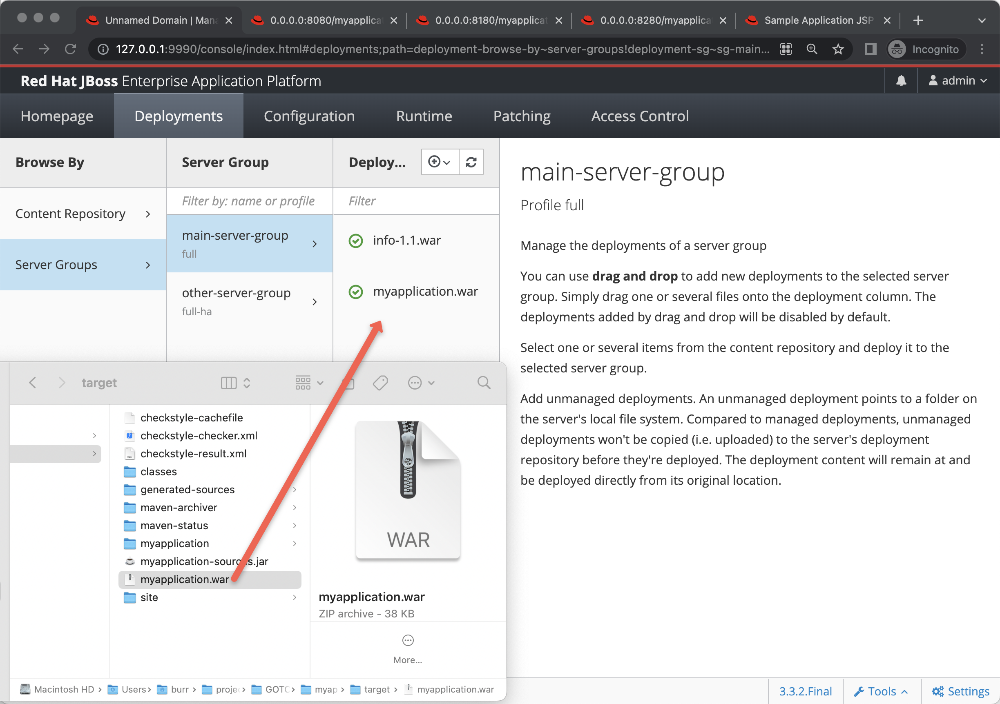

## JBoss

```
export PATH=/Users/burr/projects/GOTOams/jboss-eap-7.4/bin:$PATH%
```

```
cd myapplication-war

mvn compile package

jboss-cli.sh -c --controller=localhost:9990 --command="deploy --force /Users/burr/projects/GOTOams2022/wars/myapplication-war/target/myapplication.war"
```

You can also drag & drop the .war




##  Kubernetes

#### Start up a Kube cluster some place


https://redhat-scholars.github.io/kubernetes-tutorial/kubernetes-tutorial/installation.html#install-minikube

https://docs.openshift.com/rosa/rosa_install_access_delete_clusters/rosa_getting_started_iam/rosa-installing-rosa.html

https://github.com/burrsutter/xKS-docs


```
cd myapplication-spring

mvn compile package

docker build -f src/main/docker/Dockerfile -t docker.io/burrsutter/myapplication-spring:1.0.0 .

docker login

docker push docker.io/burrsutter/myapplication-spring:1.0.0

```


```
cd myapplication-quarkus

mvn compile package

docker build -f src/main/docker/Dockerfile -t docker.io/burrsutter/myapplication-quarkus:1.0.0 .

docker login

docker push docker.io/burrsutter/myapplication-quarkus:1.0.0

```


```
kubectl create namespace mystuff
kubectl config set-context --current --namespace=mystuff

kubectl apply -f myapplication-deployment-live-ready.yml
kubectl apply -f myapplication-service.yml
# openshift-only
oc expose service myapplication
# produces a public URL route - kubectl get routes
```

